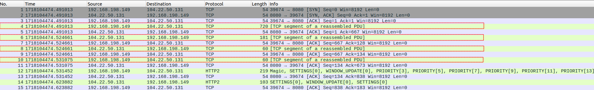
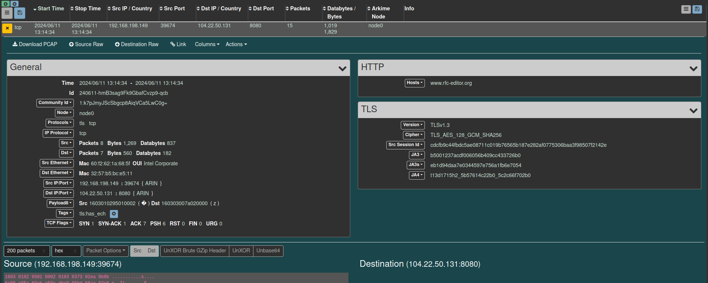

## Analyzing TLExport's output

### Wireshark
Analyzing TLExport's output with Wireshark is pretty much straight forward. Just open the PCAPNG of the decrypted traffic in Wireshark, and you should be good to go.<br> If you have used the --metadata option, it is possible that Wireshark does no automatically identifies the TLS-Handshake-Packets.


In this screenshot, the packets outlined in red, are the TLS-Handshake Packets.
### Zeek
You can read the output file with the following command: ```zeek -Cr out.pcapng local```<br>
Zeek currently does not support HTTP/2 or HTTP/3 out of the box (see [Zeek Docs](https://docs.zeek.org/en/v5.0.10/frameworks/tls-decryption.html#decrypting-a-trace-file)). Sessions using these protocols will have the notice ```bad_HTTP-request``` e.g. in the ```weird.log``` unless you have a plugin installed handling these protocols.
### Arkime
You can import the output file with the command: ```path/to/arkime/bin/capture -c /path/to/arkime/etc/config.ini -r output.pcapng --copy```<br>

An example session in Arkime with TLS-Handshake-Data

#### Note:
Decrypted data from QUIC-Traffic is currently exported in UDP Datagrams, without the additional QUIC-Information or HTTP/3-Decompression.
